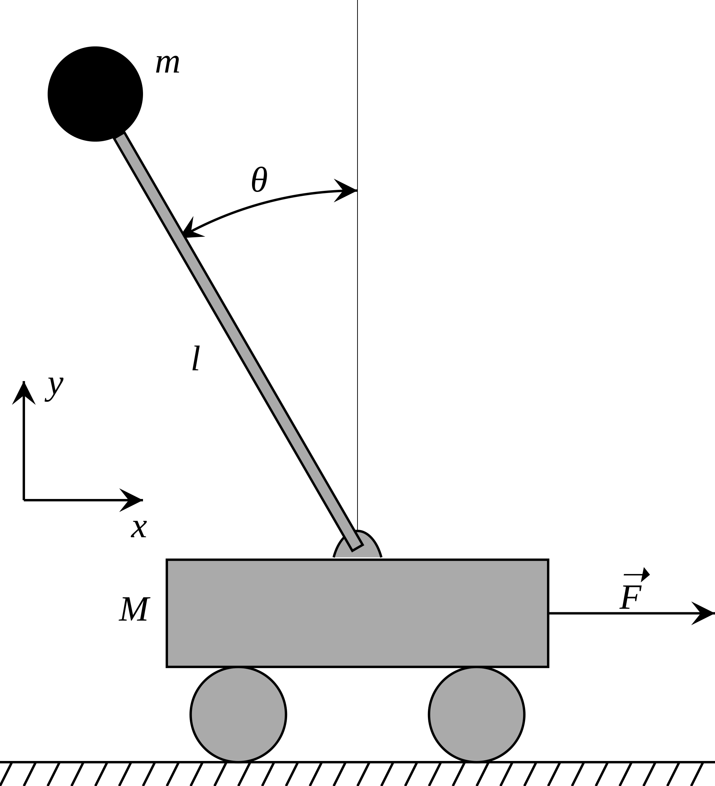
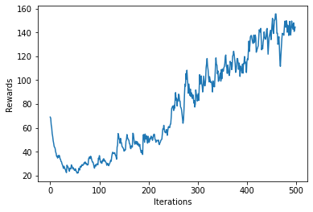

# RL-Cartpole

## Reinforcement Learning
Reinforcement learning (RL) is a subset of machine learning which poses learning problems as interactions between agents and environments. 
It often assumes agents have no prior knowledge of a world, so they must learn to navigate environments by optimizing a reward function.

## Cartpole/ Agent
A pole is attached by an un-actuated joint to a cart, which moves along a frictionless track. The system is controlled by applying a force of +1 or -1 to the cart. The pendulum starts upright, and the goal is to prevent it from falling over. A reward of +1 is provided for every timestep that the pole remains upright. 
The episode ends when the pole is more than 15 degrees from vertical, or the cart moves more than 2.4 units from the center.

## Output Graph 

## Resources

https://gym.openai.com/

https://en.wikipedia.org/wiki/Reinforcement_learning

http://introtodeeplearning.com/

